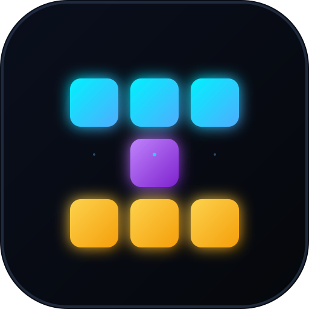

# ⚡ WIZZING — Quantum Block Odyssey (2026–2056)

> **The next-generation, tactile block puzzle game engineered for the next 30+ years.**
> Facelifted, modernized, hyper-fluid, procedural, and accessible across generations from kids to grandparents.



---

## 🌟 Key Highlights & Innovations

- **Timeless 30-Year Architecture**:
  - Built with **React 19**, **TypeScript**, **Vite**, **HTML5 High-DPI Canvas**, and **Capacitor 7**.
  - 100% offline-ready with **zero external asset dependencies** — the audio engine is synthesized mathematically in real-time via Web Audio API.
  - 60 FPS / 120 FPS sub-pixel smooth interpolated piece movements and physics particles.

- **Dimensional Odyssey (10 Unique Stages)**:
  1. **Genesis Neon**: Master tactile Super Rotation System (SRS) with ghost projection.
  2. **Anti-Gravity Vortex**: Inverted quantum blocks that reverse gravity and eliminate obstacles.
  3. **Prism Cascade**: Explosive bomb detonators and gold multiplier blocks.
  4. **Laser Matrix**: Horizontal laser sweep periodically incinerates bottom rows.
  5. **Glitch Core**: Shape-shifting mutating blocks requiring rapid lock decisions.
  6. **Cryo Frost**: Permafrost ice blocks requiring double clears to shatter.
  7. **Hyper Velocity**: 1.5x gravity rush with combo multiplier bonuses.
  8. **Seismic Quake**: Tectonic tremors push up garbage rows from below.
  9. **Titan Colossus (Boss Fight)**: 1,500 HP cyber-guardian damaged by line clears and Wizzing combos!
  10. **Singularity 2056**: The ultimate 30-year challenge combining multiple dimensional hazards.

- **UI / UX Extravaganza for Young & Older Generations**:
  - **Senior / High-Visibility Mode**: Large bold typography, high-contrast block rendering, relaxed gravity speeds, and haptic confirmations.
  - **4 Hand-Crafted Visual Themes**: *Cyber Neon 2026*, *Obsidian Clarity*, *Zen Pastel*, and *Classic 1989 Mono*.
  - **Tactile Multi-Touch Virtual Gamepad**: Ergonomic thumb controls with Left-Handed and Right-Handed toggle.
  - **Intuitive Swipe Gestures**: Swipe to move, flick down for hard drop, tap to rotate, swipe up to hold.
  - **Procedural Synthesizer**: Reimagined dynamic cyber-synth soundtrack that scales tempo with stack danger.

---

## 📱 Platforms & Installation

### 1. Mobile Android APK
- Automatically compiled on every push by **GitHub Actions CI/CD** (`.github/workflows/ci.yml`).
- Download `Wizzing-v1.0.0.apk` directly from the GitHub Actions **Artifacts** tab on your mobile phone and tap install.
- To build locally with Android Studio:
  ```bash
  cd android
  ./gradlew assembleDebug
  ```

### 2. Apple iOS
- Fully compatible with iOS Safari as a **Progressive Web App (PWA)**:
  1. Open the game in Safari on iPhone or iPad.
  2. Tap the Share button -> **"Add to Home Screen"**.
  3. Launches full screen with safe-area notch support, haptics, and zero browser chrome.
- Native Xcode workspace available in `ios/App/App.xcworkspace`.

### 3. Desktop & Web
- Run locally:
  ```bash
  npm install
  npm run dev
  ```
- Use keyboard shortcuts:
  - `←` / `→` or `A` / `D`: Move left / right
  - `↓` or `S`: Soft drop
  - `Space`: Hard drop slam
  - `↑` or `W` / `X`: Rotate clockwise
  - `Z` or `Ctrl`: Rotate counter-clockwise
  - `C` or `Shift`: Hold piece
  - `P` or `Esc`: Pause / Resume
  - `M`: Mute / Unmute

---

## 🛠️ GitHub Actions CI / CD

The repository is pre-configured with `.github/workflows/ci.yml`:
- **Web Build & Typecheck**: Compiles TypeScript and bundles production assets.
- **Android APK Compilation**: Sets up Java 17 and Android SDK to compile `app-debug.apk` and uploads it as `Wizzing-v1.0.0.apk`.
- **iOS Scaffolding Verification**: Validates Apple iOS project structure and Capacitor sync.

---

## 📜 License & Longevity Guarantee

Designed in 2026. Built with standard, open web technologies to run reliably without obsolescence until 2056 and beyond.
